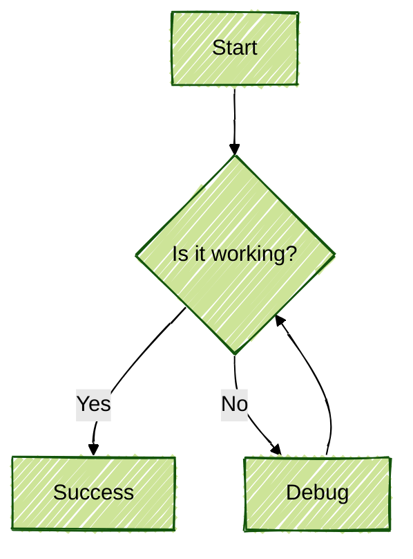

```mermaid
%% init 블록 설정 가이드
%% look: handDrawn 또는 classic
%% theme: default, neutral, dark, forest, base
%%{init:{
    "look":"handDrawn", 
    "theme": "forest"  
}}%%
graph TD
    A[Start] --> B{Is it working?}
    B -- Yes --> C[Success]
    B -- No --> D[Debug]
    D --> B
    
```